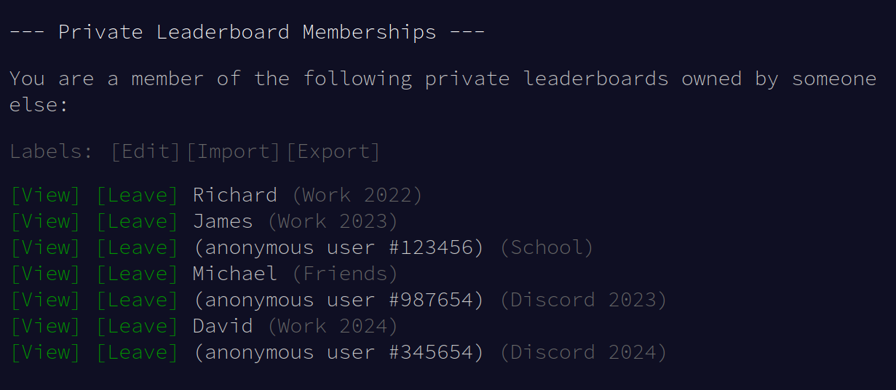
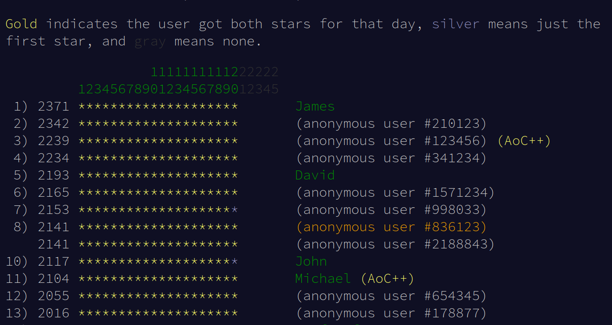

# Advent of Code userscripts

Userscripts to improve the Advent of Code interface. Install with a [userscript manager](https://violentmonkey.github.io/).

## Custom labels for private leaderboards

[Install script](https://github.com/sndv/aoc-userscripts/raw/refs/heads/master/scripts/private-leaderboard-labels.user.js)

Allows adding labels to private leaderboards.

## Visible anonymous name

[Install script](https://github.com/sndv/aoc-userscripts/raw/refs/heads/master/scripts/visible-anonymous-name.user.js)

If your name is set to show up as anonymous it will be in orange in all leaderboards.

